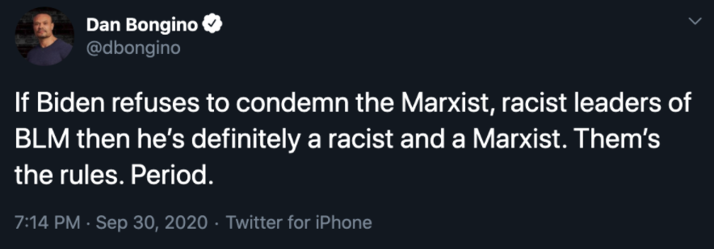
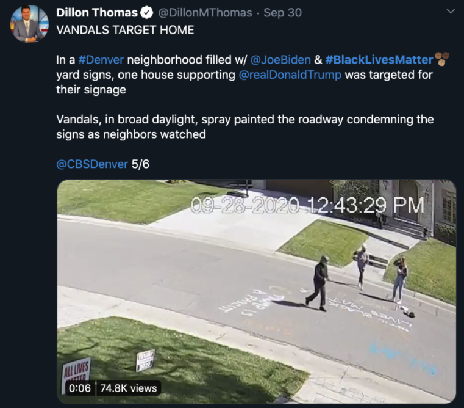
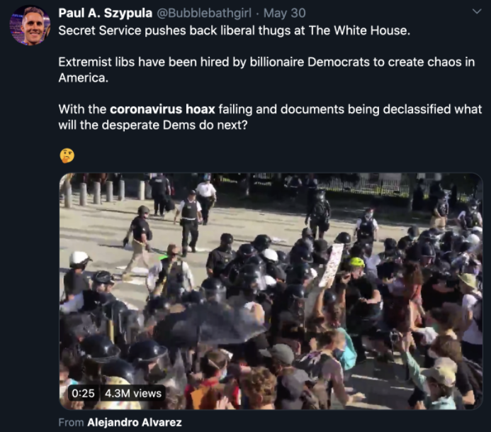
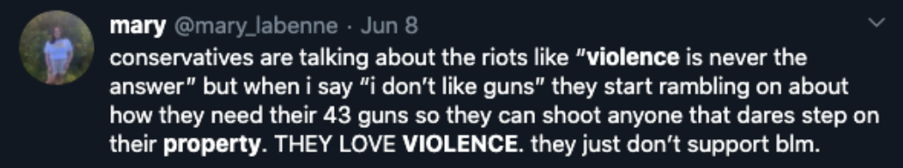
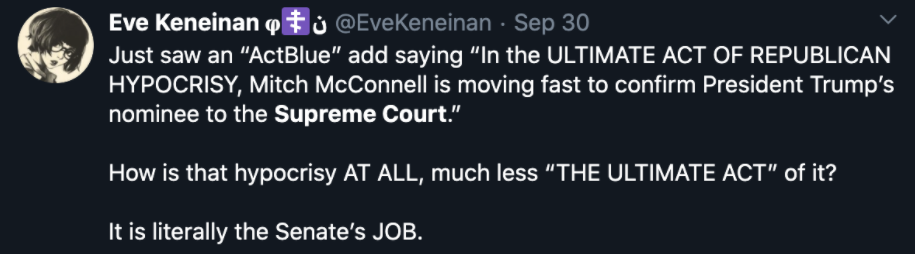

```{r setup, include=FALSE}
knitr::opts_chunk$set(echo = TRUE)
library(tidyverse)
library(knitr)
library(broom)
```
## Introduction
Today, it is easy to feel as though the media we consume is driving us to insanity. With the advent of the information age, spawned by, among other things, the expansion of the internet and the creation of social media, it seems as though we are constantly being bombarded not just by information, but by emotionally charged information intended to affect the way we perceive and react to the world: information that seems intended to cause outrage. We already know that these textual media indeed have the power to change the way we feel and think. As one 2017 study on advocacy organizations’ social media activity conveys, “Neuroscientists and psychologists have uncovered evidence that physical interaction is not necessary for the activation of mirror neurons enabling emotional or cognitive synchrony. Instead, they find people change their mental state in response to audiovisual cues or text alone” (Bail, “Channeling” 5).

This fact alone is quite frightening. Theoretically speaking, individuals can potentially get exposed to any variety of emotionally charged content and misinformation, and as Zeynep Tufekci pointed out in her talk "We’re Building a Dystopia to Make People Click on Ads", the content that people see online can drive them to act differently in the real world. This phenomenon, coupled with the divisive, polarizing political content that has taken over social media over the last few years (as illustrated by The Social Dilemma, a 2020 documentary film), could prove to have devastating consequences. According to The Social Dillemma’s Tristan Harris, these consequences could potentially include something as devastating as civil war.
While legislative solutions to the issue surrounding the spread of polarizing, divisive, outrage-inducing content have been proposed by specialists in many disciplines, it is important to understand the root of this issue to ascertain how to attack the problem. In other words, to resolve the issue, it is crucial to understand why this content is so easy to spread throughout social media in the first place. In the same aforementioned talk, Tufekci places a significant portion of the blame on “the algorithms”, the recommender systems used by platforms like Facebook and Twitter to choose what content to show to users. Though it is unclear exactly what these algorithms are trained on, Harris’ The Social Dilemma proposes a few intuitive ideas, including (but not limited to) selecting for content that grabs users’ attention and, therefore, for content that users are more likely to engage with. Engagement can be quantified by a variety of criteria, though. On Twitter, likes, retweets, reading/writing replies, and interacting with user’s profiles are all statistics visible to content authors that can be used to track engagement. For instance, these metrics were used in a 2020 study conducted by Alina Pavlova and Pauwke Bakers to understand what kind of content on Twitter most effectively raises awareness about widespread mental health issues. It is therefore feasible to believe that Twitter can select what content to show users in part based on the content that they “engage” the most with, whether that engagement takes the form of liking or retweeting a tweet, viewing the replies of or replying to a tweet, or visiting the profile of the author of a tweet. 

Given the well-established phenomenon of the rapid spread of hostile, emotionally-charged, outrage-inducing discourse on Twitter, the obvious question arises: does something about the way in which users interact with Twitter contribute to the spread of this divisive content? More specifically, are users’ engagement patterns contributing to the spread of outrage-inducing content on Twitter? Intuitively, algorithms trained to maximize engagement or time spent on the service can be trained to suggest outrage-inducing, divisive content if users are more likely to engage with such content. The purpose of this study is to investigate this very possibility through the lens of a highly controversial, divisive, and often outrage-inducing subject matter, politics, among a population that is deeply, emotionally invested in the subject matter: college students. More specifically, this study will investigate whether or not college students are more likely to engage with political Twitter content that causes them to experience negative emotions than content that does not.

## Background
This section will provide theoretical justification for the hypothesis of this study, that college students will engage more with political content that elicits negative emotions than content that does not, and the assumptions it is based on. Before focusing on political content specifically, we must ask why those who generate content attempt to appeal to our emotions in the first place. After all, if appealing to our emotions wasn’t an effective strategy to promote a message or idea, it is very likely that these polarizing, divisive messages wouldn’t be so popular throughout social media to begin with. Pavlova and Bakers’ study explored the role of emotion in the propagation of social media messages after first establishing through multiple citations that “emotional energy is a more likely driving force for the public domain discourse than reason.” One of the study’s key findings was that among Tweets pertaining to mental health, “topics with higher emotional energy were persistently driving the discourse (p < 0.001), mostly by engagement (p < 0.001) and to a lesser extent by high confidence and solidarity (p < 0.01),” where “emotional energy” was a term derived from a different study: “Emotional energy arises from deep engagement with something (Csikszentmihalyi, 1996), or in interaction by intense involvement and commitment, often accompanied by strong emotions and feelings of solidarity, confidence, conviction, and collective effervescence.” This supported their initial claim that emotions played a more significant role in discourse than pure reason alone, but their finding was significant because it verified this concept in the virtual world.

Of course, emotional language on Twitter can be both positive and negative, and it is crucial to make the distinction between the two to better understand the effect of emotionally charged content. In one 2016 article, Christopher Bail describes a study analyzing social media messages regarding Autism Spectrum Disorders (ASDs). When discussing the role of emotional language, both positive and negative, in determining the virality of social media campaigns about Autism Spectrum Disorders, Bail writes, “Although numerous studies indicate that fear-based messages attract more attention than do dispassionate appeals, my results show that exchanges of emotional language between advocacy organizations and social media users—particularly positive emotional language—further increase the virality of advocacy messages” (Bail, “Emotional”). While political content does occasionally involve encouraging, positive messages to incite advocacy or action among the public, given the increasingly divisive political climate of the United States, this may not apply to a significant share of the overly-emotional political content on Twitter. Rather, “negative” or controversial political messages may make up the majority, which Bail discusses immediately after the aforementioned quote: “Second, my results showed that exchanges of negative emotional language between advocacy organizations and social media users—although less common—are also associated with viral views” (Bail, “Emotional”). This claim hints at the possibility that users will be more likely to engage with Tweets that elicit negative emotions in themselves, since divisive content that aligns with their views would be viewed as pure fact rather than an “emotionally positive” call for action. In other words, under the assumption that users may view emotionally charged political content that they agree with as objective fact rather than as an emotional outcry, they may perceive equally emotional content that goes against their views as being much more emotionally charged. As a result of this distorted perception, such users may be more likely to interact with content that upsets or frustrates them due to dissension or fear, further spreading this polarizing content, thereby adding more fuel to the fire. 

Though it is the purpose of this study to verify this notion, simply the potential for it to exist is frightening, especially when analyzed beyond its impact on the individual. If recommender algorithms optimize for attention and time spent on an application (rather than the positivity of a message or its invitation to engage in some sort of advocacy), and negatively charged messages receive more attention, these algorithms could create a vicious cycle: users are exposed to more negative content since it’s more likely to hold their attention, they share and interact with that content, and as a result, spread it to even more users. 

Though the connection between Bail’s claim and this study’s hypothesis may be far fetched, again given the context of his claim and the context of this study, the notion of emotions driving political behavior is not. George Marcus speaks to the effect of emotion in influencing individuals’ beliefs and involvement in his article Emotions and politics: hot cognitions and the rediscovery of passion. He cites a study from 1986 that showed that “variations in demeanor [of political candidates] had much more influence than party identification or ideology” which was confirmed by a later study in 1988 that concluded that “[emotionally] affective responses to candidates have greater consequence on voter preferences than do issue or ideological statements” (Marcus, 209).

One of the emotional responses that individuals can have to politics, of course, is anger. In his investigation into the emotional nature of anti-elite politics, Paul Marx finds that anger “has the potential to mobilize even disadvantaged or inattentive citizens to participate in politics” (Marx). These observed phenomena could potentially lead to a two-sided issue. On one hand, from the perspective of political content-generators, this would only encourage any attempt to incite emotion into and even enrage their audiences. On the other hand, if one’s emotions are aroused on social media, they can conveniently act on those emotions and politically participate by engaging with the content and/or spreading it. This two-sided issue could be another source for the same vicious cycle described above: content generators pump out the same emotionally charged content, users interact with and share content, which, whether or not an algorithm has any effect in the matter, causes it to be shared to more individuals, resulting in a propagation of outrage-inducing content. It is therefore crucial to understand the nature of the spread of this negative, polarizing, outrage-inducing content on social media, because there are many systems and biases in place that can allow such a spread to take place.

Collectively, these works lay a theoretical foundation for this study’s hypothesis, that undergraduate college students will be more likely to engage with content that they react negatively to than content that they do not react negatively to, to rest upon.


## Procedure
To test the research question, a Google Form that simulated Twitter was shared among college students all over the country. The form contained three parts. The first presented screenshots of 18 political tweets on controversial subject matter, including the coronavirus pandemic, Donald Trump’s nomination of Amy Cohen Barrett to the Supreme Court, and racial justice protests that took place in the summer of 2020. The tweets were selected to be controversial to simulate the divisive, polarizing nature of the content that dominates political Twitter today, and they were found both by using Twitter’s search functionality (to find tweets containing specific words or phrases that were published within a specific timeframe) and by going through popular political Twitter accounts. Users were asked how they would engage with each tweet if they were to see it on their Twitter feed, and for each tweet they were given the option to “Like”, “Retweet with quote”, “Retweet without quote”, “Click on author’s profile”, “View replies”, and “Write reply”. Users could select any number of options, but if they did not wish to engage with the tweet in any way, they also had the option to “Ignore/keep scrolling”. This way, the questions could be made mandatory so that users had to answer, but users weren’t required to engage with each tweet. Each question in this first section ended up taking a similar form to the question pictured below:

{width=50%}

In the next part of the form, users were presented the same tweets in the same random order, but this time, were asked to provide an emotional response to each tweet. The options provided were fear, hope, sadness, joy, distress, relief, frustration, empathy, dissension, and agreement, which were based on Ira Roseman’s model described in his article “Appraisal Determinants of Emotions: Constructing a More Accurate and Comprehensive Theory” published in 1996. Again, all questions on the survey were made mandatory, so if users had none of these emotional responses, they also indicate apathy with an option marked “NONE”. Respondents were asked about their emotional response after they were asked about their engagement since they may have acted differently towards each tweet if they were consciously aware of their emotional reaction to it. Questions in this section took the following form:

{width=50%}

At the very end of the survey, users were asked about their political beliefs, where they were asked to self identify as either “Extremely liberal”, “Liberal”, “Moderately liberal”, “Centrist”, “Moderately conservative”, “Conservative”, or “Extremely conservative”. Users were told multiple times throughout the survey that their responses would be completely anonymized, and that any information they provided would not be used to identify them, nor would their responses be associated with any component of their individual identity. This was emphasized strongly so that respondents didn’t feel hesitant to engage with the content however they would have if they were on Twitter.

To attract as many participants as possible, the survey was spread throughout various social media groups primarily made up of college students, and individuals were incentivized to take the study by being offered a chance to enter a raffle for one of three gift cards.

Responses were written to a CSV which underwent additional formatting done by [this python script](https://github.com/jaiveerk/political-twitter-analysis/blob/master/preprocessor.py). In addition to anonymizing the responses, the script also formatted responses from the first two sections into binary variables.

## Tweets Used
The following screenshots were used in the survey in order:

{width=50%}

{width=50%}

{width=50%}

{width=50%}

{width=50%}

{width=50%}

{width=50%}

{width=50%}

{width=50%}

{width=50%}

{width=50%}

{width=50%}

{width=50%}

{width=50%}

{width=50%}

{width=50%}

{width=50%}

{width=50%}


## Results

### Exploratory Data Analysis
We begin a discussion of the results with some exploratory data analysis.

```{r}
data <- read.csv('formatted_responses.csv')
numberRespondents <- unique(data$Respondent) %>%
  length
num_uni <- unique(data$College) %>%
  length()

numberRespondents
num_uni
  
```

Through the data collection methods above, responses were collected from 203 students attending 48 different universities. These were both public and private universities scattered throughout the country from the University of Florida to Stanford University. 

This variety of colleges likely had an impact on the next statistic observed - the respondents' political stances. 

```{r}
ideology <- data %>%
  group_by(Ideology) %>%
  summarise(count=n()*100/3654) 

ideology

ideology %>%
  ggplot(aes(x="", y=count, fill=Ideology)) + 
  geom_bar(stat="identity", width=1) +
  coord_polar("y", start=0) + theme_void()

```


As expected, the vast majority of college students identified themselves as being left of center. Given the well known phenomenon that college students will generally be left of center, going into the experiment, one concern was that there wasn't going to be enough representation of right-wing political viewpoints. Though the validity of the data has yet to be seen in additional tests, nearly a quarter of respondents identified as either centrists or right of center, which was a greater portion than initially expected. 

As for the tweets themselves, it may be useful to understand how respondents engaged with them in general. The graphs below show, on average, the portion of respondents that performed each kind of engagement on each tweet.

```{r}
data %>%
  group_by(Tweet) %>%
  summarise(
    average_like = mean(Engagement_Like)
  ) %>%
  ggplot(aes(x=average_like)) + geom_histogram(bindwidth=0.01) + theme_minimal()
```

First, most tweets either received very few likes, or were liked by about 50% of the respondents. Given the political nature of these tweets, these disparate rates may be a result of the heavy left-leaning bias that exists in the respondents. If most of the respondents were left leaning, then it makes sense that most of the respondents would act similarly, either uniformly liking or not liking a tweet. While it may be pointed out that a "like" rate of 0.5 does not indicate a "uniform liking" of the tweet by the respondents, the distinct separation between the two peaks in the histogram is certainly worth noting.

```{r}
data %>%
  group_by(Tweet) %>%
  summarise(
    average_retweet_without = mean(Engagement_Retweet.without.quote)
  ) %>%
  ggplot(aes(x=average_retweet_without)) + geom_histogram(bindwidth=0.01) + theme_minimal()
```

The next engagement pattern, retweets without quotes, shows a slightly different story. While a few tweets were, on average, retweeted occasionally (between 10 and 20% of the time), the vast majority of tweets were retweeted rarely, if ever. While not as indicative of any sort of political bias among the respondents, this pattern is somewhat of a different expected trend: people's reluctance to publicly engage with political content in general, and therefore the controversial subject matter intentionally selected for this study. Retweets, more than any kind of engagement, clearly associate the user with the content being retweeted to the public eye. This is a consequence that many college students, whether or not they're seeking professional and academic opportunities, may not want to inflict upon themselves, and as a result, they may be hesitant to retweet this controversial, polarizing content. 

```{r}
data %>%
  group_by(Tweet) %>%
  summarise(
    average_retweet_with = mean(Engagement_Retweet.with.quote)
  ) %>%
  ggplot(aes(x=average_retweet_with)) + geom_histogram(bindwidth=0.01) + theme_minimal()
```

We can observe a similar pattern for retweets with quotes, which respondents were even less likely to perform; likely for the same aforementioned reasons.

```{r}
data %>%
  group_by(Tweet) %>%
  summarise(
     average_view_replies = mean(Engagement_View.replies)
  ) %>%
  ggplot(aes(x=average_view_replies)) + geom_histogram(bindwidth=0.01) + theme_minimal()
```

Yet another distinct pattern can be observed for viewing replies, which makes sense. Unlike the first three forms of engagement, viewing replies is not a form of engagement that is directly visible to one's following. As a result, it may be a form of engagement that users are more likely to do across all tweets. This was, to some extent, reflected in the above histogram. Just about every tweet had its replies viewed between 20 and 40 percent of the time, with a single outlier on each side of that interval. 

```{r}
data %>%
  group_by(Tweet) %>%
  summarise(
    average_profile_click = mean(Engagement_Click.on.author.s.profile)
  ) %>%
  ggplot(aes(x=average_profile_click)) + geom_histogram(bindwidth=0.01) + theme_minimal()
```

Next, though viewing author profiles are also a private form of engagement, users seemed to be far less likely to do that than to view replies, with most tweets having their replies viewed less than 10 percent of the time.

```{r}
data %>%
  group_by(Tweet) %>%
  summarise(
    average_write_reply = mean(Engagement_Write.reply)
  ) %>%
  ggplot(aes(x=average_write_reply)) + geom_histogram(bindwidth=0.01) + theme_minimal()
```

By far the least common form of engagement taken was writing replies to the tweet, likely for the same reasons that caused the low frequencies of retweets. Only one tweet had more than five percent of the respondents indicate that they would write a reply to it.

```{r}
data %>%
  group_by(Tweet) %>%
  summarise(
    average_ignore = mean(Engagement_Ignore.keep.scrolling)
  ) %>%
  ggplot(aes(x=average_ignore)) + geom_histogram(bindwidth=0.01) + theme_minimal()


```

In a move somewhat contradictory to many of the assumptions introduced in the background of this study, ignoring tweets seemed to be, by far, the most common response to the tweets in this study, with the least-ignored tweets being ignored 30-40% of the time, and the most frequently ignored tweets being ignored over 70% of the time. This outcome may be due to a number of factors, including the time at which this survey was conducted: the weeks leading up to the 2020 Presidential Election. Most respondents had probably been overexposed to political content leading up to the survey, and as a result, were probably desensitized to much of the content on the survey. This may have resulted in a higher rate of apathy towards the political content than if the survey was conducted at a different, less politicized time of year. One may compare this phenomenon to the playing of Christmas carols in public spaces throughout the United States during the holiday season. The first listening of Mariah Carey's "All I Want for Christmas is You" may fill many with a warm, pleasant feeling inside, but by late December, most are numb to the amorous holiday-themed lyrics and upbeat melody.

Before investigating correlations involving emotional reactions to the tweets, an analysis similar to the one conducted for engagement may be of some worth. The histograms below show the portion of users that had each emotional response to each tweet.

```{r}
data %>%
  group_by(Tweet) %>%
  summarise(
    average_joy = mean(Reaction_Joy)
  ) %>%
  ggplot(aes(x=average_joy)) + geom_histogram(bindwidth=0.01) + theme_minimal()
```

To begin, little to no joy was felt by respondents for just about every tweet in the corpus, with most tweets instilling joy in around 0% of the participants. The single outlier in the data seems to be a tweet for which only 8% of respondents felt joy. This graph can be said to demonstrate, to at least some capacity, how little joy political Twitter brings to college students. While these data can be interpreted to convey that college students simply don't enjoy politics, perhaps the more likely reason for this outcome is the current emotional climate of political content on Twitter.

```{r}
data %>%
  group_by(Tweet) %>%
  summarise(
    average_sadness = mean(Reaction_Sadness)
  ) %>%
  ggplot(aes(x=average_sadness)) + geom_histogram(bindwidth=0.01) + theme_minimal()
```

The negative counterpart to joy in this study was sadness, which seemed to be a much more popular response across the entire corpus. Though still reported in less than half of the respondents for every tweet, the portion of respondents that report sadness are generally significantly higher than the portion that expressed joy. 

```{r}
data %>%
  group_by(Tweet) %>%
  summarise(
    average_relief = mean(Reaction_Relief)
  ) %>%
  ggplot(aes(x=average_relief)) + geom_histogram(bindwidth=0.01) + theme_minimal()
```
```{r}
data %>%
  group_by(Tweet) %>%
  summarise(
     average_distress = mean(Reaction_Distress)
  ) %>%
  ggplot(aes(x=average_distress)) + geom_histogram(bindwidth=0.01) + theme_minimal()
```

The same trend seems to be even more exaggerated in the next pair of emotions, relief and distress. In a response that aligned perfectly with the earlier description of today's political climate, distress seemed to be a much more common response to the displayed tweets than relief. While most tweets incited distress in 10 to 30 percent of respondents, most tweets fostered relief in less than 1% of the respondents who saw them. These trends are indicative of the very issue that motivated this paper: political content on Twitter is outrage-inducing. Whether or not this phenomenon is intentional, it is an issue that absolutely needs to be better understood for the sake of the entire US population.


```{r}
data %>%
  group_by(Tweet) %>%
  summarise(
    average_hope = mean(Reaction_Hope)
  ) %>%
  ggplot(aes(x=average_hope)) + geom_histogram(bindwidth=0.01) + theme_minimal()

data %>%
  group_by(Tweet) %>%
  summarise(
    average_fear = mean(Reaction_Fear)
  ) %>%
  ggplot(aes(x=average_fear)) + geom_histogram(bindwidth=0.01) + theme_minimal()
```

While the distributions are not dramatically different in the graphs that showed how many respondents reacted with hope and fear, the graph for the former is significantly more right skewed than that of the latter. While fear was not exactly common, with most tweets triggering fear in less than 15% of the respondents, there were several that did so in more than 20% of the respondents. Meanwhile, only two tweets inspired hope in 10% or more of the respondents, indicating that for the tweets that were intentionally selected to be controversial fear tended to be a much more common reaction than hope. 

```{r}
data %>%
  group_by(Tweet) %>%
  summarise(
    average_empathy = mean(Reaction_Empathy)
  ) %>%
  ggplot(aes(x=average_empathy)) + geom_histogram(bindwidth=0.01) + theme_minimal()

data %>%
  group_by(Tweet) %>%
  summarise(
    average_frustration = mean(Reaction_Frustration)
  ) %>%
  ggplot(aes(x=average_frustration)) + geom_histogram(bindwidth=0.01) + theme_minimal()
```

A clear demonstrator of the polarizing nature of political tweets is the disparity in responses among the next pair of emotional responses, frustration and empathy. Continuing the trend, there were many more tweets that elicited the negative emotion in a high portion of respondents than tweets that elicited the positive emotion. While most tweets inspired empathy in less than 10% of the respondents, almost every tweet provoked frustration in more than 30% of the respondents, with several provoking frustration in more than 60% of the respondents. These widely-frustrating tweets were tweets 14, 6, and 10, which, in order, called the coronavirus a hoax, showed protesters clashing with law enforcement officers to the glee of the tweet author, and defended a white supremacist group. If political tweets are, on average, generating more frustration than empathy in their audiences, then it only makes sense that those audiences will become increasingly polarized and divided.


```{r}
data %>%
  group_by(Tweet) %>%
  summarise(
    average_agreement = mean(Reaction_Agreement)
  ) %>%
  ggplot(aes(x=average_agreement)) + geom_histogram(bindwidth=0.01) + theme_minimal()

data %>%
  group_by(Tweet) %>%
  summarise(
    average_dissension = mean(Reaction_Dissension)
  ) %>%
  ggplot(aes(x=average_dissension)) + geom_histogram(bindwidth=0.01) + theme_minimal()
```


The last pair of emotions provided to respondents were dissension and agreement. The two had similar distributions: tweets either incited these emotions in more than 30% of the respondents, or in less than 10%. One feature worth nothing though is that there were several tweets that garnered agreement from more than 50% of the users, while there was only one such tweet for dissension. This may be indicative of a political bias in the respondents or in the survey. On one hand, the respondents may have disproportionately agreed upon certain political messages. On the other, the survey may have contained a disproportionately large number of tweets that were widely agreeable across all political groups. Determining which kind of bias exists, and the extent to which it exists, would likely require more testing with a larger set of tweets and a larger sample population.

```{r}
data %>%
  group_by(Tweet) %>%
  summarise(
    average_apathy = mean(Reaction_NONE)
  ) %>%
  ggplot(aes(x=average_apathy)) + geom_histogram(bindwidth=0.01) + theme_minimal()
```

In addition to the aforementioned emotional responses, respondents also had the option to mark "NONE", indicating that they had no significant emotional response to the tweet. Half of the tweets had between 20 and 40% of the respondents mark this as their response, while the rest of the tweets were just outside this range. This was especially interesting given one of the assumptions reached in the background of this paper, which stated that it is in the best interest of political content generators to produce intentionally emotionally-charged content since it will generally spread more and draw more participation than purely reason-based content. However, it is possible that the content was emotionally charged, and, as was said before, respondents had simply been overexposed to political content prior to taking the survey. As a result, respondents may have been much more likely to feel apathetic to the content in the survey than if they hadn't taken the survey in the weeks leading up to a presidential election.

### The Influence of Political Beliefs on Engagement
Before diving directly into the relationship between individuals' emotional response to political content and their engagement with it, it may be valuable to first understand how their political beliefs affect their engagement. After all, it only makes sense that one's emotional disposition regarding political tweets would be heavily influenced by their political beliefs. Therefore, any relationship between people's ideological stances and their engagement may provide context necessary to this study's attempt at answering the focal question.

The following graphs show, for each tweet, how engagement varied across two political groups: respondents who identified as moderately liberal, liberal, or extremely liberal, and respondents who identified as centrist, moderately conservative, conservative, or extremely conservative. Centrists were grouped in with the second category since, even without it, the first group already holds the vast majority of the respondents.

```{r}

# dividing respondents into two groups
data <- data %>%
  mutate(political_group = case_when(
    Ideology == "Moderately Liberal" | Ideology == "Liberal" | Ideology == "Extremely liberal" ~ "Left",
    TRUE ~ "Not Left"
  ))

gen_engagement_graph <- function(tweetNumber){
  toReturn <- data %>%
    filter(Tweet==tweetNumber) %>%
    dplyr::select(Engagement_Like, Engagement_Retweet.with.quote, Engagement_Retweet.without.quote, Engagement_Click.on.author.s.profile, Engagement_View.replies, Engagement_Write.reply, Engagement_Ignore.keep.scrolling, political_group) %>%
    group_by(political_group) %>%
    summarise(
      like_proportion = mean(Engagement_Like),
      rt_without_proportion = mean(Engagement_Retweet.without.quote),
      rt_with_proportion = mean(Engagement_Retweet.with.quote),
      click_profile_proportion = mean(Engagement_Click.on.author.s.profile),
      view_replies_proportion = mean(Engagement_View.replies),
      write_replies_proportion = mean(Engagement_Write.reply),
      ignore_proportion = mean(Engagement_Ignore.keep.scrolling)
    ) %>%
    gather(key = Engagement, value = Proportion, like_proportion:ignore_proportion) %>%
    ggplot(aes(Engagement, Proportion, fill = political_group)) + geom_col(position = "dodge")+ coord_flip() + labs(title = paste(c("Tweet", tweetNumber), collapse = " ")) 

  return(toReturn)
}

```

```{r}
gen_engagement_graph(1)

```

Tweet 1, which was made by a democrat running for Congress, expressed enthusiasm for policies currently being fought for by the left, including an expansion of public education and governmental healthcare and, most notably, a "Green New Deal". Engagement of almost all kinds were significantly more common among respondents in the "left" group apart from viewing and writing replies. Slightly more than 20% of respondents in both political groups viewed the Tweet's replies, with respondents not identifying with the left viewing replies slightly more frequently. Although relatively few respondents indicated they would do so, writing replies was selected much more frequently by non-left respondents than left-identifying respondents. 


```{r}
gen_engagement_graph(2)

```

Tweet 2 discussed the controversial, widespread destruction of property that took place after the murder of George Floyd in late May and early June. Likes and both kinds of retweets were more common among left-identifying responses, but non-left respondents viewed replies with almost the same frequency and wrote replies with greater frequency. Nearly twice as many non-left respondents ignored the tweet as left-identifying respondents.


```{r}
gen_engagement_graph(3)

```

Tweet 3 criticized Democratic presidential candidate Joe Biden's refusal to condemn the "Marxist" leaders of the leftist "Black Lives Matter" movement. Given the aggressive nature of the tweet, very few respondents opted to retweet it, and though the only respondents that liked it were non-left, less than 10% of respondents in that group did so. Many respondents completely ignored the tweet, with more than 50% of left-identifying respondents opting to do so. Interestingly enough, frequencies of private engagement remained relatively high for both groups, with more than 40% of left-identifying respondents viewing the replies (and nearly as many for non-left respondents), and just over 20% of both groups clicking on the author's profile.


```{r}
gen_engagement_graph(4)

```

Tweet 4 discussed a video in which individuals spray painted messages on the road in front a home with pro-Trump signage in a predominantly liberal neighborhood. All forms of engagement were relatively low, with roughly 60 percent of both groups simply ignoring the tweet, but once again, viewing the replies of the tweet was quite common, with nearly 40% of respondents in both groups indicating that they would do so. This seems to be evidence of a growing trend of individuals stepping across ideological lines to view the replies of Tweets filled with content that they may disagree with, thereby engaging with them. 

```{r}
gen_engagement_graph(5)

```

Tweet 5 is a skeptical claim that Trump was trying to push a Supreme Court nominee so that in the event that the outcome of the election went to them, the court would be more likely to rule in favor of Trump. Non-left respondents ignored this tweet at an extremely high rate, with almost 80% of them indicating that they would do so. However, nearly 20% of the respondents in this group opted to view the tweet's replies, with just over 30% of left-identifying respondents indicating they would also do the same. 

```{r}
gen_engagement_graph(6)

```

Tweet 6 describes a video in which, as the author describes, the "Secret Service pushes back liberal thugs at the white house". The tweet author also calls the COVID-19 pandemic a hoax. While just about 60% of the respondents in both groups opted to ignore the tweet, nearly 40% of both groups indicated that they would view the tweet's replies. This is especially interesting, since despite the controversial nature of the tweet, significant portions of both groups choose to engage with the tweet.

```{r}
gen_engagement_graph(7)

```

Tweet 7 makes a comparison between left-wing and right-wing "extremism", putting the former in a much more positive light. This clear bias may explain why so many of the left-identifying respondents liked the tweet, over 40%. However, once again, both groups viewed replies quite frequently, with non-left respondents at just over 20%, and left-identifying respondents at nearly 30%. Nearly 10% of both groups also chose to click on the author's profile.

```{r}
gen_engagement_graph(8)

```

Tweet 8 was an exclamation by Florida Representative Matt Gaetz that Republicans wanted to "OPEN AMERICA UP" rather than lock it down as a response to the pandemic. More than 60% of both groups ignored the tweet, but for those who didn't, non-left respondents liked and retweeted the tweet at a higher rate, but left-identifying respondents indicated they would click on the author's profile, view replies, or write a reply more often than non-left respondents. 

```{r}
gen_engagement_graph(9)

```

Tweet 9, written by Bernie Sanders, points out the fact that Donald Trump has paid substantially more in tax dollars to other countries than he has in the United States. Unsurprisingly, left-identifying respondents engaged with the content more frequently in almost every category. Another notable feature of the graph is that once again, over 20% of both left-identifying and non-left respondents wanted to view the tweet's replies.

```{r}
gen_engagement_graph(10)

```

Tweet 10 contained a message defending the "Proud Boys", a white supremacist group, citing the fact that the author hadn't heard of this group doing any kind of "looting, torching, or rioting." Once again, most respondents either ignored the controversial tweet or viewed its replies. Over 10% of non-left respondents indicated that they would like the tweet, indicating perhaps another potential means by which controversial tweets could easily spread: simply by users who agree with the message propagating it to their followers. 

```{r}
gen_engagement_graph(11)

```

Tweet 11 discusses the recent confirmation of Amy Cohen Barrett to the Supreme Court, saying that the left has no "moral authority to stand on... after what they did to Brett Kavanaugh". Left-identifying respondents indicated they would retweet with a quote more frequently than non-left respondents, but both likes and retweets without a quote were significantly more frequent among non-left respondents than left-identifying respondents. Once again, a significant portion of respondents from both groups indicated that they would view the tweet's replies, with a higher portion of left-identifying respondents indicating that they would do so (nearly 30%!) despite the fact that the tweet promotes a right-wing viewpoint.

```{r}
gen_engagement_graph(12)

```

In tweet 12, Bernie Sanders points out that Amazon has paid nearly nothing in federal income taxes over the last three years. A significant number of both left-identifying and non-left respondents "liked" the tweet, with 60% of the first category and over 20% of the second category of respondents doing so. Retweet and profile clicks were done at a higher rate for left-identifying respondents, but non-left respondents more frequently indicated that they would view and write replies. This serves as yet another occurrence of individuals crossing ideological lines to engage with tweets (albeit in just a few, specific ways) more frequently than individuals whose ideological stances align more closely with the message of the tweet.

```{r}
gen_engagement_graph(13)

```

Tweet 13 attempted to bring attention to the fact that Donald Trump, whom the author called a white supremacist, has been responsible for placing three judges on the Supreme Court. The tweet was ignored by over 80% of non-left respondents, which may explain why left-identifying respondents performed every type of engagement much more frequently than non-left respondents.

```{r}
gen_engagement_graph(14)

```

Tweet 14 was written by a radio show host advertising his podcast in which he and his co-host "talk the coronavirus hoax, and how masks are merely symbolic, and do nothing to protect you". Despite the significant emotional energy contained in this tweet, over 70% of respondents from both groups ignored the tweet, as the only significant form of engagement was viewing replies, which over 20% of respondents from both categories indicated they would do.

```{r}
gen_engagement_graph(15)

```

Tweet 15 is a proclamation by Rep. Matt Gaetz that Donald Trump is leading the fight against corruption and against "the establishment". The tweet was ignored often by both left-identifying and non-left respondents (over 80% and 60% respectively), but when it was engaged with, it was engaged with by a larger portion of non-left respondents in just about every way. The only significant engagement that left-identifying respondents performed was viewing the tweets replies, which they opted to do just under 12.5% of the time.

```{r}
gen_engagement_graph(16)

```

Tweet 16 points out the fallacy in claiming that wearing a mask in the midst of a pandemic is tyranny, but that an 8pm curfew in the midst of a protest isn't -- clearly a left-leaning message. This tweet was liked and retweeted frequently by left-identifying respondents (almost 60%  and 20% of the time, respectively). While the portion of non-left respondents that liked the tweet was around 10%, the portion that desired to retweet was nearly 15%: an interesting discrepancy given that retweeting generally shows more support for a message than does liking a tweet, and given that the tweet's message aligns much more with the left than the right. Another interesting feature of this graph is the proportion of non-left respondents that indicated they wished to view the replies of the tweet, 30%, especially when compared to the smaller proportion of left-identifying respondents that indicated wanting to do the same.

```{r}
gen_engagement_graph(17)

```

Tweet 17 accuses conservatives of "loving" violence given their defense of their decision to own firearms all while they patronize the left for engaging in non-peaceful protests. Almost 80% of the non-left respondents indicated that they would ignore the tweet, but still a significant number of these respondents, nearly 20%, indicated that they wished to view the tweet's replies. Non-left respondents were also significantly more likely to write replies than left-identifying respondents, who had higher frequencies of every other kind of engagement.

```{r}
gen_engagement_graph(18)
```

The last tweet of the corpus criticizes the left's claim that Mitch McConnell's attempt to rapidly push in Donald Trump's latest Supreme Court justice is hypocritical, saying that the claim is baseless because doing so is the senate's job. Non-left respondents engaged with the tweet more frequently in every form of engagement apart from one: viewing replies. Both left-identifying and non-left respondents indicated they wanted to view the tweet's replies over 20% of the time, with left-identifying respondents doing so slightly more frequently. 

The 18 tweets above have proven to give mixed results. Political belief seemed to be a decent predictor of users' choices to like, retweet, or ignore the tweet, where users seemed to do the former two when the tweet's message aligned with their beliefs, and did the latter when it did not. We can verify these patterns by summarizing all 18 of the above tweets into one larger graph, which shows how users of each group, left and not left, engaged with tweets that were aligned more with the left or the right:

```{r}
data %>%
  mutate(tweet_type = case_when(
    Tweet %in% c(1, 2, 5, 7, 9, 12, 13, 16, 17) ~ "Left",
    TRUE ~ "Right"
  )) %>%
  mutate(response_type = case_when(
    tweet_type == "Left" & political_group == "Left" ~ "Left Respondent to Left Tweet",
    tweet_type == "Left" & political_group == "Not Left" ~ "Non-left Respondent to Left Tweet",
    tweet_type == "Right" & political_group == "Left" ~ "Left Respondent to Right Tweet",
    tweet_type == "Right" & political_group == "Not Left" ~ "Non-left Respondent to Right Tweet"
  )) %>%
    select(Engagement_Like, Engagement_Retweet.with.quote, Engagement_Retweet.without.quote, Engagement_Click.on.author.s.profile, Engagement_View.replies, Engagement_Write.reply, Engagement_Ignore.keep.scrolling, response_type) %>%
    group_by(response_type) %>%
    summarise(
      like_proportion = mean(Engagement_Like),
      rt_without_proportion = mean(Engagement_Retweet.without.quote),
      rt_with_proportion = mean(Engagement_Retweet.with.quote),
      click_profile_proportion = mean(Engagement_Click.on.author.s.profile),
      view_replies_proportion = mean(Engagement_View.replies),
      write_replies_proportion = mean(Engagement_Write.reply),
      ignore_proportion = mean(Engagement_Ignore.keep.scrolling)
    ) %>%
    gather(key = Engagement, value = Proportion, like_proportion:ignore_proportion) %>%
    ggplot(aes(Engagement, Proportion, fill = response_type)) + geom_col(position = "dodge")+ coord_flip() 

 

```

As was observed manually through the 18 tweets above, left-identifying respondents were much more likely to like and retweet left-aligned tweets than they were for right-aligned tweets. They also ignored right-aligned tweets far more often than they ignored left-aligned tweets, but they viewed the replies of left-aligned tweets almost exactly as often as they viewed the replies of right-aligned tweets. 

Meanwhile, non-left respondents liked right-aligned tweets almost exactly as frequently as they liked left-aligned tweets. This may be due to the fact that centrists make up a significant portion of the non-left population, but even then, the fact that the conservative portion of the non-left respondents weren't responsible for any sort of separation between the two categories of tweets is intriguing. There also wasn't much separation between the frequencies at which non-left respondents ignored left-aligned and right-aligned tweets, and the same seems to hold true for retweets without quotes. As was the case with the left-identifying respondents, though, non-left respondents wished to view the replies of right aligned and left aligned tweets at roughly the same frequency.

### The Influence of Emotional Response on Engagement
Now that some relationship between political ideology and engagement has been observed, adequate context has been established to analyze the relationship between emotion and engagement. This process can begin by first looking at how different emotional states contributed to a user's likelihood of performing each kind of engagement. This can be ascertained through a logistic regression model that predicts whether or not a user performed a certain kind of engagement based on their emotional response to the tweet. Only coefficients with a p-value under 0.05 will be discussed, as they are the only statistically-significant relationships that can be observed using the standard alpha value of 0.05.

```{r}
logreg_data <- data %>%
  mutate(Engagement_Like = as.factor(Engagement_Like)) %>%
  mutate(Engagement_Retweet.with.quote = as.factor(Engagement_Retweet.with.quote)) %>%
  mutate(Engagement_Retweet.without.quote = as.factor(Engagement_Retweet.without.quote)) %>%
  mutate(Engagement_Click.on.author.s.profile = as.factor(Engagement_Click.on.author.s.profile)) %>%
  mutate(Engagement_View.replies = as.factor(Engagement_View.replies)) %>%
  mutate(Engagement_Write.reply = as.factor(Engagement_Write.reply)) %>%
  mutate(Reaction_Fear = as.factor(Reaction_Fear)) %>%
  mutate(Reaction_Hope = as.factor(Reaction_Hope)) %>%
  mutate(Reaction_Sadness = as.factor(Reaction_Sadness)) %>%
  mutate(Reaction_Joy = as.factor(Reaction_Joy)) %>%
  mutate(Reaction_Distress = as.factor(Reaction_Distress)) %>%
  mutate(Reaction_Relief = as.factor(Reaction_Relief)) %>%
  mutate(Reaction_Frustration = as.factor(Reaction_Frustration)) %>%
  mutate(Reaction_Empathy = as.factor(Reaction_Empathy)) %>%
  mutate(Reaction_Dissension = as.factor(Reaction_Dissension)) %>%
  mutate(Reaction_Agreement = as.factor(Reaction_Agreement)) 

```

```{r}
like_model <- glm(Engagement_Like ~ Reaction_Fear + Reaction_Hope + Reaction_Sadness + Reaction_Joy + Reaction_Distress + Reaction_Relief + Reaction_Frustration + Reaction_Empathy + Reaction_Dissension + Reaction_Agreement, data = logreg_data,  family = binomial)

kable(tidy(like_model, exponentiate = FALSE, conf.int = TRUE), format = "markdown", digits = 3)
```

The first engagement that users had the option to select was to like the tweet. The above model shows that, in accordance with the hypothesis, there were multiple negative emotions that made users more likely to like the tweet. For instance, it shows that, holding all else constant, if a user experienced fear from a tweet, the odds of them liking the tweet were `r exp(0.608)` times higher than if they hadn't experienced fear. Moreover, holding all else constant, feeling sadness and frustration increased the odds that a respondent would like a tweet by factors of `r exp(0.584)` and `r exp(0.411)` respectively. The remaining statistically significant emotional responses were hope, dissension, and agreement, which had coefficients of 1.697,  -2.705, and 2.879 respectively. All three of these had a dramatic effect on the odds that a respondent would like a tweet, where, with all else held constant, each would change the odds by factors of `r exp(1.697)`,  `r exp(-2.705)`, and `r exp(2.879)` in the same order.

```{r}
rt_with_model <- glm(Engagement_Retweet.with.quote ~ Reaction_Fear + Reaction_Hope + Reaction_Sadness + Reaction_Joy + Reaction_Distress + Reaction_Relief + Reaction_Frustration + Reaction_Empathy + Reaction_Dissension + Reaction_Agreement, data = logreg_data,  family = binomial)

kable(tidy(rt_with_model, exponentiate = FALSE, conf.int = TRUE), format = "markdown", digits = 3)
```

The only statistically significant predictors of the log-odds that a respondent would retweet a tweet with a quote were frustration and agreement, both of which increased the odds that a respondent would do so by factors of `r exp(0.955)` and `r exp(1.731)` with all else held equal for each.

```{r}
rt_without_model <- glm(Engagement_Retweet.without.quote ~ Reaction_Fear + Reaction_Hope + Reaction_Sadness + Reaction_Joy + Reaction_Distress + Reaction_Relief + Reaction_Frustration + Reaction_Empathy + Reaction_Dissension + Reaction_Agreement, data = logreg_data,  family = binomial)

kable(tidy(rt_without_model, exponentiate = FALSE, conf.int = TRUE), format = "markdown", digits = 3)
```

There were a few more statistically significant emotional responses for retweets without quotes than for retweets with quotes. Both fear and hope seemed to increase the odds that a respondent would retweet a tweet without a quote by factors of `r exp(0.926)` and `r exp(0.984)` respectively, with all else held equal for each. Experiencing joy also increased the odds that a respondent would retweet a tweet by a factor of `r exp(0.865)` with all else held equal. A similar effect was observed when respondents experienced frustration, emapthy, and agreement, as all increased the odds that a respondent would retweet a tweet without a quote by factors of `r exp(0.521)`, `r exp(0.607)`, and `r exp(2.109)` holding all else equal. Dissension was the lone emotional response to decrease the odds of retweeting without a quote, doing so by a factor of `r exp(-2.064)` with everything else held constant. 

```{r}
click_model <- glm(Engagement_Click.on.author.s.profile ~ Reaction_Fear + Reaction_Hope + Reaction_Sadness + Reaction_Joy + Reaction_Distress + Reaction_Relief + Reaction_Frustration + Reaction_Empathy + Reaction_Dissension + Reaction_Agreement, data = logreg_data,  family = binomial)

kable(tidy(click_model, exponentiate = FALSE, conf.int = TRUE), format = "markdown", digits = 3)
```

Fear, hope, and agreement were the only emotional responses that had a statistically significant effect on respondents' odds of clicking on the profile of a tweet's author. They all increased the odds of doing so by factors of `r exp(0.648)`, `r exp(0.896)`, and `r exp(0.3)` respectively, with all else held equal.

```{r}
view_replies_model <- glm(Engagement_View.replies ~ Reaction_Fear + Reaction_Hope + Reaction_Sadness + Reaction_Joy + Reaction_Distress + Reaction_Relief + Reaction_Frustration + Reaction_Empathy + Reaction_Dissension + Reaction_Agreement, data = logreg_data,  family = binomial)

kable(tidy(view_replies_model, exponentiate = FALSE, conf.int = TRUE), format = "markdown", digits = 3)
```

A wide range of emotions affected respondents' odds of viewing the replies of a tweet. Fear, hope, frustration, empathy, and agreement were the five that had statistically significant relationships with respondents' decision to view a tweet's replies, as each increased the odds of respondents doing so by respective factors of `r exp(0.633)`, `r exp(0.653)`, `r exp(0.375)`, `r exp(0.519)`, and `r exp(0.287)`, with all else held equal.

```{r}
write_reply_model <- glm(Engagement_Write.reply ~ Reaction_Fear + Reaction_Hope + Reaction_Sadness + Reaction_Joy + Reaction_Distress + Reaction_Relief + Reaction_Frustration + Reaction_Empathy + Reaction_Dissension + Reaction_Agreement, data = logreg_data,  family = binomial)

kable(tidy(write_reply_model, exponentiate = FALSE, conf.int = TRUE), format = "markdown", digits = 3)
```

The last form of engagement that users had the option to perform was writing replies, which seems to be most significantly related to emotional responses of hope, distress, frustration, dissension, and agreement. The first four all increased the odds that respondents would choose to write replies, with each increasing the odds of doing so by factors of `r exp(1.428)`, `r exp(1.164)`, `r exp(0.839)`, `r exp(1.068)` respectively with all else held equal for each. The only emotional response that significantly decreased the odds that a participant would write a reply was agreement, which decreased the odds of writing a reply by a factor of `r exp(-1.202)`.

The last option that participants had on the survey wasn't an engagement, but rather, a lack thereof: to ignore the Tweet, and "keep scrolling" through their Twitter feed. Understanding the emotional responses that caused respondents to select this option can provide valuable information, though. To look at which emotional responses prompted engagement in general, one can look at the emotional responses that decreased the odds that a respondent would ignore a tweet.

```{r}
ignore_model <- glm(Engagement_Ignore.keep.scrolling ~ Reaction_Fear + Reaction_Hope + Reaction_Sadness + Reaction_Joy + Reaction_Distress + Reaction_Relief + Reaction_Frustration + Reaction_Empathy + Reaction_Dissension + Reaction_Agreement, data = logreg_data,  family = binomial)

kable(tidy(ignore_model, exponentiate = FALSE, conf.int = TRUE), format = "markdown", digits = 3)
```

The statistically significant emotional responses with negative coefficients in this model were fear, hope, frustration, and agreement. In other words, with all else held constant, each of these emotions decreased the odds that a respondent would ignore a tweet by factors of `r exp(-0.445)`, `r exp(-1.591)`, `r exp(-0.545)`, and `r exp(-1.898)` respectively.

These findings can be verified by seeing which emotional responses were the best predictors of total engagement, found by adding up all the forms of engagement that users indicated they would perform for each given tweet. Given that this total engagement value would no longer be binary, a linear regression model would be more appropriate:

```{r}
linreg_data <- data %>%
  mutate(total_engagement = Engagement_Like + Engagement_Retweet.with.quote + Engagement_Retweet.without.quote + Engagement_Click.on.author.s.profile + Engagement_View.replies + Engagement_Write.reply) %>%
  mutate(Reaction_Fear = as.factor(Reaction_Fear)) %>%
  mutate(Reaction_Hope = as.factor(Reaction_Hope)) %>%
  mutate(Reaction_Sadness = as.factor(Reaction_Sadness)) %>%
  mutate(Reaction_Joy = as.factor(Reaction_Joy)) %>%
  mutate(Reaction_Distress = as.factor(Reaction_Distress)) %>%
  mutate(Reaction_Relief = as.factor(Reaction_Relief)) %>%
  mutate(Reaction_Frustration = as.factor(Reaction_Frustration)) %>%
  mutate(Reaction_Empathy = as.factor(Reaction_Empathy)) %>%
  mutate(Reaction_Dissension = as.factor(Reaction_Dissension)) %>%
  mutate(Reaction_Agreement = as.factor(Reaction_Agreement)) 

total_model <- lm(total_engagement ~ Reaction_Fear + Reaction_Hope + Reaction_Sadness + Reaction_Joy + Reaction_Distress + Reaction_Relief + Reaction_Frustration + Reaction_Empathy + Reaction_Dissension + Reaction_Agreement, data = linreg_data) 

tidy(total_model, conf.int = TRUE, level = 0.95) %>%
  kable(digits = 3)

```

Not only were fear, hope, frustration, and agreement statistically significant predictors of total engagement (this time with coefficients of 0.32, 0.659, 0.199, and 0.779), but the linear model also shows that joy and empathy also had significant positive correlations with total engagement numbers (with coefficients of 0.307 and 0.308 respectively). These coefficients can be interpreted as follows. According to the model, on average, one can expect a user's total number of engagements with a tweet to increase by the value of the coefficient if they were to feel that emotion, holding all else equal. 


### Additional Discussion of Results
Given the significant number of results that have been extracted from the survey, there is much to unpack, analyze, and extrapolate from. To begin, it is important to reintroduce the hypothesis of this study: that tweets that cause negative emotional responses in their audience will field more engagement than tweets that do not. 

This hypothesis can first be understood from the angle of individuals' political beliefs. As was demonstrated in the first part of the main results section, there exists a complex relationship between individuals' political beliefs and the way in which they interact with content that both aligns with and goes against their views. It is not the case that individuals will always engage more with tweets that align with their views, nor is it the case that they will always engage more with tweets that go against them. For example, as can be observed from the data above, while there was a clear trend for forms of engagement like retweets and likes among left-identifying respondents, there was no such trend for viewing replies or ignoring tweets.

As is the case with any study, it is very possible that trends may have been either exaggerated or obfuscated simply due to the methods of data collection. In the case of this study, this concept is apparent in how different tweets of the same political alignment exhibited different patterns of engagement across the two groups of respondents, thereby obfuscating any trend that may have otherwise appeared in the data. For instance, tweet 8, in which Florida Rep Matt Gaetz calls for America to be opened back up, doesn't exhibit any clear pattern between political alignment and how users engaged with the tweet. While non-left respondents were more likely to retweet and like the tweet, left-identifying respondents were noticeably more likely to view replies and click on the author's profile. This deviates from the general trend that was observed across all 18 tweets (that non-left respondents were just as likely to view the replies of right-aligned tweets and click on the profiles of the authors who wrote them). It is difficult to know whether the patterns observed in this tweet are representative of reality or if they're simply anomalies, and since the general conclusions drawn from this study are drawn, in part, using this tweet, it's impossible to know whether those general conclusions are nearer to or further from reality because of it.

The point of this study was to choose intentionally controversial, polarizing tweets, but it's difficult to make generalizations about "polarizing tweets" when these tweets cover subject matter of varying levels of controversy (which is difficult to quantify to begin with). Therefore, it becomes difficult to make generalizations about the way in which users interact with these controversial tweets, and to then tie that to their political stance. Tweet 6, for example, showed scenes of aggression and conflict between protesters and law enforcement officials shortly after the murder of George Floyd. While it was a tweet whose message was more aligned with that of the political right in the United States, the super controversial nature of the tweet, along with its brash language, may have caused individuals to act differently from how they may have acted towards other controversial tweets. While the data for this tweet did support some trends observed in other tweets, as it was liked significantly more by non-left respondents and ignored more by left-identifying respondents, the data contradicted other trends, like how left-identifying respondents retweeted the tweet with a quote at a higher frequency than non-left respondents. 

Nearly 40% of both groups indicated that they would want to view the replies of the tweet, likely due to the tweet's super controversial nature, which is no insignificant piece of information. First, it continues the trend of respondents in both political groups responding to tweets at roughly the same frequency. Second, and perhaps more importantly, it shows that users are still interacting with these tweets to a pretty significant extent. As was mentioned in the beginning of this document, the purpose of this study was to understand, to some extent, why social media platforms like Twitter seem to select for and propagate outrage-inducing content. As was also mentioned, it seems intuitive that a content-recommendation algorithm would attempt to find content that keeps users on the apps more. If such controversial tweets are drawing engagement from users and prompting them to spend more time on the application by viewing the tweet's replies, which again, almost 40% of respondents from both groups indicated they would do, then it makes sense that any recommender using the aforementioned criteria would prioritize similarly controversial, outrage-inducing content.

The same phenomenon can be observed with Tweet 14, which called the COVID-19 pandemic a hoax and made the claim that masks were "merely symbolic". Similar patterns hold, where non-left respondents were more likely to like the tweet, left-identifying respondents were more likely to retweet with a quote, and over 70% of both groups opted to ignore the tweet entirely, but over 20% of both sets of respondents indicated that they would view the replies. Again, it shows how tweets of varying controversy can draw varying patterns of engagement, so any generalized patterns observed or conclusions drawn from the data above may have been skewed due to varying levels of controversy among the tweets in the survey. It also shows how extremely controversial tweets can incite users to spend more time on the application by viewing the tweet's replies, likely influencing individuals' recommender systems to continue to prioritize such outrage-inducing, polarizing content.

Given these variations that exist between the tweets, it may be difficult to make any factual statement about the relationship between users' emotional responses to political tweets and the way in which they engage with them, and therefore, it may be difficult to verify the hypothesis of this study. However, an attempt will be made to do so based on the data that was collected.

The data collected show that negative emotions increased the odds that respondents would perform just about every kind of engagement. Fear, for instance, significantly increased the odds that a respondent would like a tweet, retweet it without a quote, click the profile of an author, and view a tweet's replies. While sadness only significantly increased the odds that a user would like a tweet, frustration significantly increased the odds that a user would like a tweet, retweet it with or without a quote, and view and write replies to tweets. Distress and dissension only significantly increased the odds that a user would write a reply to a tweet. It is also worth noting that fear and frustration were both statistically significant in the last model as well, which was made to predict the number of types of engagement that users would perform on a given tweet based on their emotional response to it. This may be interpreted to mean that both effected multiple types of engagement from the respondents on a very frequent basis.

The findings above clearly uphold the hypothesis. Every negative emotion apart from dissension significantly increased, and never decreased, the odds that a respondent would perform at least one type of engagement on a tweet, showing that tweets that caused negative emotions were more likely to attract more engagement from users than tweets that did not. 

As has been mentioned, the role of dissension, and therefore of one's political beliefs, is much more complex, and does not justify nor contradict the hypothesis directly. On one hand, left-identifying respondents were much more likely to ignore right-aligned tweets than left aligned tweets, implying that they were less likely to engage with tweets that they disagreed with, which contradicts the hypothesis. Left-identifying respondents were also significantly more likely to like and retweet tweets that aligned with the left, which also contradicts the hypothesis, but they were about equally likely to view the replies of tweets and click on the profiles of authors of tweets aligning with either side, which neither disproves nor justifies the hypothesis.

Different patterns were observed for non-left respondents, who were nearly equally likely to ignore tweets regardless of their alignment, which neither justifies nor disproves the hypothesis. They were slightly more likely to view the replies of and click on the profiles of authors of right-aligned tweets, but both differences were negligible and don't strongly justify the hypothesis. 


## Conclusion - mention effect of positive emotions?
The observed differences between the effect of political stance on engagement and the effect of negative emotion on engagement point to a variety of things. One of the more obvious interpretations is that political disagreement may not necessarily connote negative emotions. Rather, they may be two separate phenomena. This concept may point to a broader idea that if disagreement does not have to connote negative emotions, perhaps it is possible to engage in online discourse where individuals' ideas and perceptions are challenged without the accompaniment of sour feelings. Of course, this sounds easier in theory than it is to perform in practice. A 2018 study by Christopher Bail showed that being exposed to virtual content on the other side of the aisle only drove those who identified as Republican to be even more conservative, while those who identified as Democrats were driven slightly left, though the second effect did not seem to be statistically significant (Bail, "Exposure"). This issue is relevant because it’s clear that the content that we’re presented with can have a significant sway on our emotions and political views, and thus, can contribute to or detract from the divisive, hostile political climate that exists online. Therefore, it’s as important as ever to understand the processes that make this issue worse than it already is, and understanding why we engage with the content that we do on social media is a step in the right direction.

As was noted earlier on, this study was imperfect in a variety of ways, and much more future research would need to be done to be able to make any factual statement on the relationship between emotional response and engagement with political content. These imperfections begin with the survey. For example, multiple respondents conveyed that in the first section, they would have liked to see an option to engage with the media that was linked to tweets, whether that meant playing a video or clicking on an article. Multiple respondents also voiced desires to represent a wider range of emotions in the second part, the most commonly requested of which was confusion. Participants also hypothesized that emojis may have allowed respondents to more accurately convey how they felt about tweets, but this comes with issues like the fact that the meaning of an emotion is subjective and therefore difficult to objectively quantify. Another issue with the survey had to do not when it was sent out: just before a presidential election. As was also discussed earlier on, it is very likely that respondents were "burnt out" from having been overloaded with political content prior to taking the survey, which may have altered how they indicated they would engage with content.

The EDA in this study made clear yet another issue: bias of the respondents. The overwhelming majority of respondents were left of center, which makes sense given that they were all college students. As a result, not only were aggregate statistics concerning the entire population likely thrown off, but statistics concerning non-left respondents may have been based on far too small of a sample size to arrive at any meaningful conclusions. The fact that respondents had to be grouped into just two relatively non-specific groups, left and non-left, is yet another issue that arose due to this imbalance in political beliefs among the respondents. Not only should future studies attempt to gain a larger, more ideologically-balanced pool of respondents, but they should also conduct similar group-based analysis with more specific groups. Doing so may entail making three groups of liberals, conservatives, and centrists, or making even more to highlight the subtleties that can exist between moderately liberal and extremely liberal respondents. 

Something that was not thoroughly discussed in this study was the role of positive emotions on engagement. Numerous results above showed that respondents engaged more with content that elicited positive emotions like joy and empathy, than content that did not, with all else held equal. These results may be indicative that, again, a political discourse that is not characterized by hate, outrage, and polarization is possible, and that instead, it may be just as easy to hold one more focused on bringing about positivity. Again, it is impossible to make any factual claim about this solely given the data used in this study, but this notion absolutely provides hope that, even if individuals are more likely to engage with content that elicits negative emotions than content that does not, there may be brighter days ahead when it comes to how politics are discussed on social media.


## Bibliography
Bail, Christopher A., et al. “Channeling Hearts and Minds: Advocacy Organizations, Cognitive-Emotional Currents, and Public Conversation.” American Sociological Review, vol. 82, no. 6, Dec. 2017, pp. 1188–1213, doi:10.1177/0003122417733673.

Bail CA. Emotional Feedback and the Viral Spread of Social Media Messages About Autism Spectrum Disorders. Am J Public Health. 2016 Jul;106(7):1173-80. doi: 10.2105/AJPH.2016.303181. Epub 2016 May 19. PMID: 27196641; PMCID: PMC4984751.

Bail, Christopher A., et al. "Exposure to opposing views on social media can increase political polarization." Proceedings of the National Academy of Sciences 115.37 (2018): 9216-9221.

Marcus, George E. “Emotions and Politics: Hot Cognitions and the Rediscovery of Passion.” Social Science Information, vol. 30, no. 2, June 1991, pp. 195–232, doi:10.1177/053901891030002001.

Marx, P. Anti‐elite politics and emotional reactions to socio‐economic problems: Experimental evidence on “pocketbook anger” from France, Germany, and the United States. Br J Sociol. 2020; 71: 608– 624. https://doi-org.proxy.lib.duke.edu/10.1111/1468-4446.12750

Pavlova A, Berkers P. Mental health discourse and social media: Which mechanisms of cultural power drive discourse on Twitter. Soc Sci Med. 2020 Oct;263:113250. doi: 10.1016/j.socscimed.2020.113250. Epub 2020 Aug 6. PMID: 32862081.

Roseman, Ira J. "Appraisal determinants of emotions: Constructing a more accurate and comprehensive theory." Cognition & Emotion 10.3 (1996): 241-278.

Tufekci, Zeynep "We're building a dystopia just to make people click on ads." TED: Ideas Worth Spreading, October 2017, https://www.ted.com/talks/zeynep_tufekci_we_re_building_a_dystopia_just_to_make_people_click_on_ads?language=en  

The Social Dilemma. Directed by Jeff Orlowski, performance by Tristan Harris, Exposure Labs, 2020. Netflix. www.netflix.com/title/81254224.

---

The git repo for this project can be found [here](https://github.com/jaiveerk/political-twitter-analysis)

